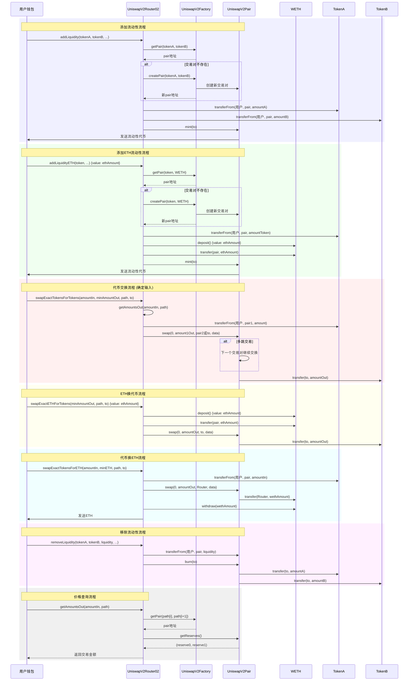

```mermaid
sequenceDiagram
    participant 用户钱包
    participant Router as UniswapV2Router02
    participant Factory as UniswapV2Factory
    participant Pair as UniswapV2Pair
    participant WETH
    participant TokenA
    participant TokenB

    %% 添加流动性
    rect rgb(240, 240, 255)
        Note over 用户钱包,Pair: 添加流动性流程
        用户钱包->>Router: addLiquidity(tokenA, tokenB, ...)
        Router->>Factory: getPair(tokenA, tokenB)
        Factory-->>Router: pair地址
        alt 交易对不存在
            Router->>Factory: createPair(tokenA, tokenB)
            Factory->>Pair: 创建新交易对
            Factory-->>Router: 新pair地址
        end
        Router->>TokenA: transferFrom(用户, pair, amountA)
        Router->>TokenB: transferFrom(用户, pair, amountB)
        Router->>Pair: mint(to)
        Pair->>用户钱包: 发送流动性代币
    end

    %% 添加ETH流动性
    rect rgb(240, 255, 240)
        Note over 用户钱包,Pair: 添加ETH流动性流程
        用户钱包->>Router: addLiquidityETH(token, ...) {value: ethAmount}
        Router->>Factory: getPair(token, WETH)
        Factory-->>Router: pair地址
        alt 交易对不存在
            Router->>Factory: createPair(token, WETH)
            Factory->>Pair: 创建新交易对
            Factory-->>Router: 新pair地址
        end
        Router->>TokenA: transferFrom(用户, pair, amountToken)
        Router->>WETH: deposit() {value: ethAmount}
        Router->>WETH: transfer(pair, ethAmount)
        Router->>Pair: mint(to)
        Pair->>用户钱包: 发送流动性代币
    end

    %% 代币交换
    rect rgb(255, 240, 240)
        Note over 用户钱包,Pair: 代币交换流程 (确定输入)
        用户钱包->>Router: swapExactTokensForTokens(amountIn, minAmountOut, path, to)
        Router->>Router: getAmountsOut(amountIn, path)
        Router->>TokenA: transferFrom(用户, pair1, amount)
        Router->>Pair: swap(0, amount1Out, pair2或to, data)
        alt 多跳交易
            Pair->>Pair: 下一个交易对继续交换
        end
        Pair->>TokenB: transfer(to, amountOut)
    end

    %% ETH交换
    rect rgb(255, 255, 240)
        Note over 用户钱包,Pair: ETH换代币流程
        用户钱包->>Router: swapExactETHForTokens(minAmountOut, path, to) {value: ethAmount}
        Router->>WETH: deposit() {value: ethAmount}
        Router->>WETH: transfer(pair, ethAmount)
        Router->>Pair: swap(0, amountOut, to, data)
        Pair->>TokenB: transfer(to, amountOut)
    end

    %% 代币换ETH
    rect rgb(240, 255, 255)
        Note over 用户钱包,Pair: 代币换ETH流程
        用户钱包->>Router: swapExactTokensForETH(amountIn, minETH, path, to)
        Router->>TokenA: transferFrom(用户, pair, amountIn)
        Router->>Pair: swap(0, amountOut, Router, data)
        Pair->>WETH: transfer(Router, wethAmount)
        Router->>WETH: withdraw(wethAmount)
        Router->>用户钱包: 发送ETH
    end

    %% 移除流动性
    rect rgb(255, 240, 255)
        Note over 用户钱包,Pair: 移除流动性流程
        用户钱包->>Router: removeLiquidity(tokenA, tokenB, liquidity, ...)
        Router->>Pair: transferFrom(用户, pair, liquidity)
        Router->>Pair: burn(to)
        Pair->>TokenA: transfer(to, amountA)
        Pair->>TokenB: transfer(to, amountB)
    end

    %% 价格查询
    rect rgb(240, 240, 240)
        Note over 用户钱包,Router: 价格查询流程
        用户钱包->>Router: getAmountsOut(amountIn, path)
        Router->>Factory: getPair(path[i], path[i+1])
        Factory-->>Router: pair地址
        Router->>Pair: getReserves()
        Pair-->>Router: (reserve0, reserve1)
        Router-->>用户钱包: 返回交易金额
    end
```