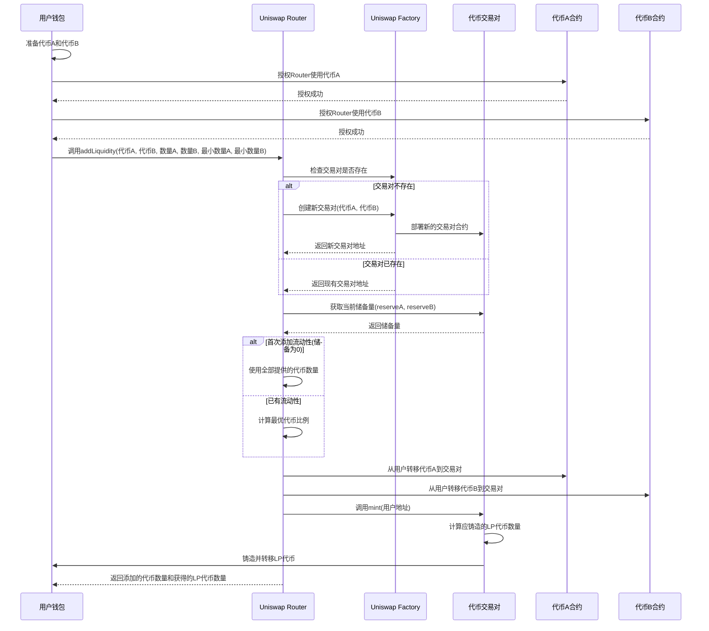
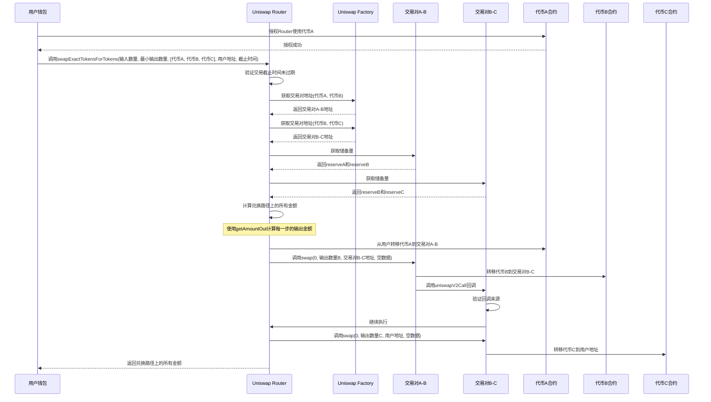
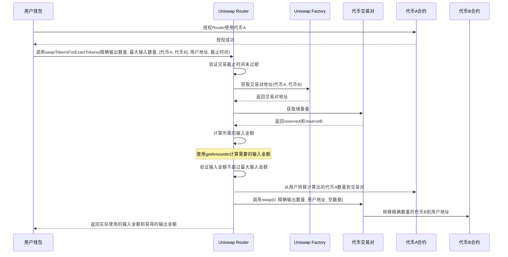
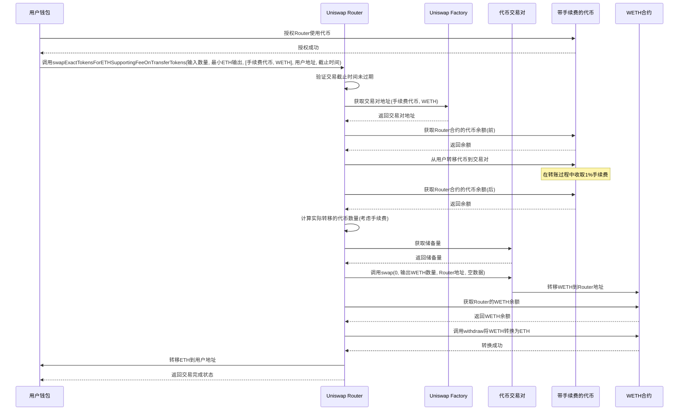
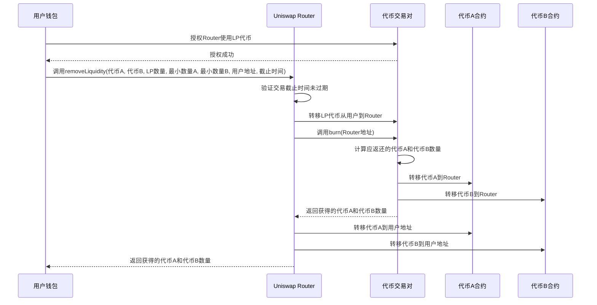
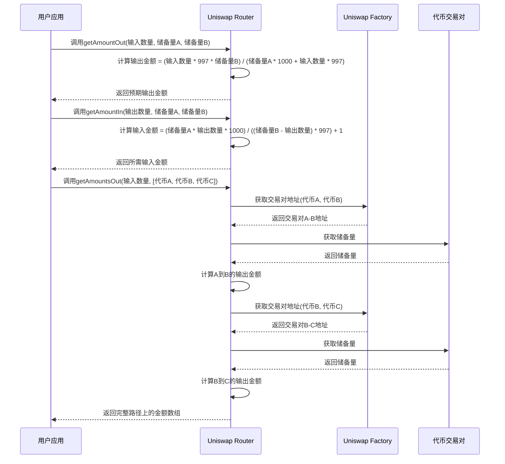
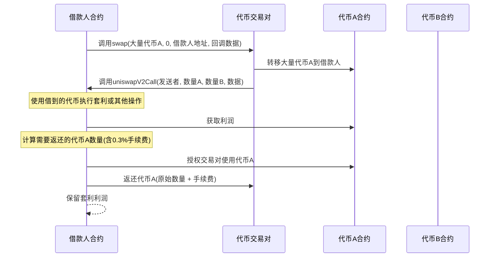

1. 添加流动性流程

```mermaid
sequenceDiagram
    participant 用户钱包 as 用户钱包
    participant Router as Uniswap Router
    participant Factory as Uniswap Factory
    participant 交易对 as 代币交易对
    participant 代币A as 代币A合约
    participant 代币B as 代币B合约
    
    用户钱包->>用户钱包: 准备代币A和代币B
    用户钱包->>代币A: 授权Router使用代币A
    代币A-->>用户钱包: 授权成功
    用户钱包->>代币B: 授权Router使用代币B
    代币B-->>用户钱包: 授权成功
    
    用户钱包->>Router: 调用addLiquidity(代币A, 代币B, 数量A, 数量B, 最小数量A, 最小数量B)
    Router->>Factory: 检查交易对是否存在
    
    alt 交易对不存在
        Router->>Factory: 创建新交易对(代币A, 代币B)
        Factory->>交易对: 部署新的交易对合约
        Factory-->>Router: 返回新交易对地址
    else 交易对已存在
        Factory-->>Router: 返回现有交易对地址
    end
    
    Router->>交易对: 获取当前储备量(reserveA, reserveB)
    交易对-->>Router: 返回储备量
    
    alt 首次添加流动性(储备为0)
        Router->>Router: 使用全部提供的代币数量
    else 已有流动性
        Router->>Router: 计算最优代币比例
    end
    
    Router->>代币A: 从用户转移代币A到交易对
    Router->>代币B: 从用户转移代币B到交易对
    Router->>交易对: 调用mint(用户地址)
    
    交易对->>交易对: 计算应铸造的LP代币数量
    交易对->>用户钱包: 铸造并转移LP代币
    
    Router-->>用户钱包: 返回添加的代币数量和获得的LP代币数量
```

2. 代币兑换流程 (确定输入金额)

```mermaid
sequenceDiagram
    participant 用户钱包 as 用户钱包
    participant Router as Uniswap Router
    participant Factory as Uniswap Factory
    participant 交易对AB as 交易对A-B
    participant 交易对BC as 交易对B-C
    participant 代币A as 代币A合约
    participant 代币B as 代币B合约
    participant 代币C as 代币C合约
    
    用户钱包->>代币A: 授权Router使用代币A
    代币A-->>用户钱包: 授权成功
    
    用户钱包->>Router: 调用swapExactTokensForTokens(输入数量, 最小输出数量, [代币A, 代币B, 代币C], 用户地址, 截止时间)
    
    Router->>Router: 验证交易截止时间未过期
    
    Router->>Factory: 获取交易对地址(代币A, 代币B)
    Factory-->>Router: 返回交易对A-B地址
    Router->>Factory: 获取交易对地址(代币B, 代币C)
    Factory-->>Router: 返回交易对B-C地址
    
    Router->>交易对AB: 获取储备量
    交易对AB-->>Router: 返回reserveA和reserveB
    Router->>交易对BC: 获取储备量
    交易对BC-->>Router: 返回reserveB和reserveC
    
    Router->>Router: 计算兑换路径上的所有金额
    Note over Router: 使用getAmountOut计算每一步的输出金额
    
    Router->>代币A: 从用户转移代币A到交易对A-B
    
    Router->>交易对AB: 调用swap(0, 输出数量B, 交易对B-C地址, 空数据)
    交易对AB->>代币B: 转移代币B到交易对B-C
    
    交易对AB->>交易对BC: 调用uniswapV2Call回调
    
    交易对BC->>交易对BC: 验证回调来源
    交易对BC->>Router: 继续执行
    
    Router->>交易对BC: 调用swap(0, 输出数量C, 用户地址, 空数据)
    交易对BC->>代币C: 转移代币C到用户地址
    
    Router-->>用户钱包: 返回兑换路径上的所有金额
```

3. 代币兑换流程 (确定输出金额)

```mermaid
sequenceDiagram
    participant 用户钱包 as 用户钱包
    participant Router as Uniswap Router
    participant Factory as Uniswap Factory
    participant 交易对 as 代币交易对
    participant 代币A as 代币A合约
    participant 代币B as 代币B合约
    
    用户钱包->>代币A: 授权Router使用代币A
    代币A-->>用户钱包: 授权成功
    
    用户钱包->>Router: 调用swapTokensForExactTokens(精确输出数量, 最大输入数量, [代币A, 代币B], 用户地址, 截止时间)
    
    Router->>Router: 验证交易截止时间未过期
    
    Router->>Factory: 获取交易对地址(代币A, 代币B)
    Factory-->>Router: 返回交易对地址
    
    Router->>交易对: 获取储备量
    交易对-->>Router: 返回reserveA和reserveB
    
    Router->>Router: 计算所需的输入金额
    Note over Router: 使用getAmountIn计算需要的输入金额
    
    Router->>Router: 验证输入金额不超过最大输入金额
    
    Router->>代币A: 从用户转移计算出的代币A数量到交易对
    
    Router->>交易对: 调用swap(0, 精确输出数量, 用户地址, 空数据)
    交易对->>代币B: 转移精确数量的代币B到用户地址
    
    Router-->>用户钱包: 返回实际使用的输入金额和获得的输出金额
```

4. 支持手续费代币的兑换流程

```mermaid
sequenceDiagram
    participant 用户钱包 as 用户钱包
    participant Router as Uniswap Router
    participant Factory as Uniswap Factory
    participant 交易对 as 代币交易对
    participant 手续费代币 as 带手续费的代币
    participant WETH as WETH合约
    
    用户钱包->>手续费代币: 授权Router使用代币
    手续费代币-->>用户钱包: 授权成功
    
    用户钱包->>Router: 调用swapExactTokensForETHSupportingFeeOnTransferTokens(输入数量, 最小ETH输出, [手续费代币, WETH], 用户地址, 截止时间)
    
    Router->>Router: 验证交易截止时间未过期
    
    Router->>Factory: 获取交易对地址(手续费代币, WETH)
    Factory-->>Router: 返回交易对地址
    
    Router->>手续费代币: 获取Router合约的代币余额(前)
    手续费代币-->>Router: 返回余额
    
    Router->>手续费代币: 从用户转移代币到交易对
    Note over 手续费代币: 在转账过程中收取1%手续费
    
    Router->>手续费代币: 获取Router合约的代币余额(后)
    手续费代币-->>Router: 返回余额
    
    Router->>Router: 计算实际转移的代币数量(考虑手续费)
    
    Router->>交易对: 获取储备量
    交易对-->>Router: 返回储备量
    
    Router->>交易对: 调用swap(0, 输出WETH数量, Router地址, 空数据)
    交易对->>WETH: 转移WETH到Router地址
    
    Router->>WETH: 获取Router的WETH余额
    WETH-->>Router: 返回WETH余额
    
    Router->>WETH: 调用withdraw将WETH转换为ETH
    WETH-->>Router: 转换成功
    
    Router->>用户钱包: 转移ETH到用户地址
    
    Router-->>用户钱包: 返回交易完成状态
```

5. 移除流动性流程

```mermaid
sequenceDiagram
    participant 用户钱包 as 用户钱包
    participant Router as Uniswap Router
    participant 交易对 as 代币交易对
    participant 代币A as 代币A合约
    participant 代币B as 代币B合约
    
    用户钱包->>交易对: 授权Router使用LP代币
    交易对-->>用户钱包: 授权成功
    
    用户钱包->>Router: 调用removeLiquidity(代币A, 代币B, LP数量, 最小数量A, 最小数量B, 用户地址, 截止时间)
    
    Router->>Router: 验证交易截止时间未过期
    
    Router->>交易对: 转移LP代币从用户到Router
    
    Router->>交易对: 调用burn(Router地址)
    
    交易对->>交易对: 计算应返还的代币A和代币B数量
    交易对->>代币A: 转移代币A到Router
    交易对->>代币B: 转移代币B到Router
    交易对-->>Router: 返回获得的代币A和代币B数量
    
    Router->>代币A: 转移代币A到用户地址
    Router->>代币B: 转移代币B到用户地址
    
    Router-->>用户钱包: 返回获得的代币A和代币B数量
```

6. 价格查询流程

```mermaid
sequenceDiagram
    participant 用户应用 as 用户应用
    participant Router as Uniswap Router
    participant Factory as Uniswap Factory
    participant 交易对 as 代币交易对
    
    用户应用->>Router: 调用getAmountOut(输入数量, 储备量A, 储备量B)
    Router->>Router: 计算输出金额 = (输入数量 * 997 * 储备量B) / (储备量A * 1000 + 输入数量 * 997)
    Router-->>用户应用: 返回预期输出金额
    
    用户应用->>Router: 调用getAmountIn(输出数量, 储备量A, 储备量B)
    Router->>Router: 计算输入金额 = (储备量A * 输出数量 * 1000) / ((储备量B - 输出数量) * 997) + 1
    Router-->>用户应用: 返回所需输入金额
    
    用户应用->>Router: 调用getAmountsOut(输入数量, [代币A, 代币B, 代币C])
    Router->>Factory: 获取交易对地址(代币A, 代币B)
    Factory-->>Router: 返回交易对A-B地址
    Router->>交易对: 获取储备量
    交易对-->>Router: 返回储备量
    Router->>Router: 计算A到B的输出金额
    
    Router->>Factory: 获取交易对地址(代币B, 代币C)
    Factory-->>Router: 返回交易对B-C地址
    Router->>交易对: 获取储备量
    交易对-->>Router: 返回储备量
    Router->>Router: 计算B到C的输出金额
    
    Router-->>用户应用: 返回完整路径上的金额数组
```

7. 闪电贷流程

```mermaid
sequenceDiagram
    participant 借款人 as 借款人合约
    participant 交易对 as 代币交易对
    participant 代币A as 代币A合约
    participant 代币B as 代币B合约
    
    借款人->>交易对: 调用swap(大量代币A, 0, 借款人地址, 回调数据)
    交易对->>代币A: 转移大量代币A到借款人
    
    交易对->>借款人: 调用uniswapV2Call(发送者, 数量A, 数量B, 数据)
    
    Note over 借款人: 使用借到的代币执行套利或其他操作
    借款人->>代币A: 获取利润
    
    Note over 借款人: 计算需要返还的代币A数量(含0.3%手续费)
    借款人->>代币A: 授权交易对使用代币A
    借款人->>交易对: 返还代币A(原始数量 + 手续费)
    
    借款人-->>借款人: 保留套利利润
```

